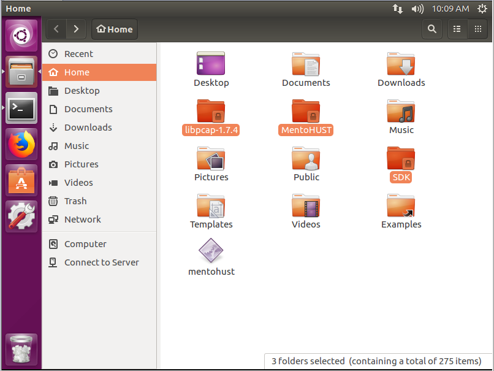

# 支持锐捷认证与IPv6的路由器配置指南：以K2P为例

### 写在「写在前言之前」之前：

由于交叉编译过程十分繁琐，容易出错，你可以到[MentoHUST-SYSU-OpenWrt](https://github.com/KumaTea/MentoHUST-SYSU-OpenWrt)获取软件包，通过OpenWrt编译工具方便的生成路由器专用软件，省去交叉编译的配置过程。

[MentoHUST可执行文件直达链接](https://github.com/KumaTea/MentoHUST-SYSU-Guide/releases)

---

_写在前言之前：_

_这篇文章是我在2018年8月10日撰写的，当时水平不足，导致文章有不少谬误；且后来[简书](https://www.jianshu.com)平台出现过一段时间不可访问的情况，让我决定作修改后搬来GitHub上。_

_修改后的文章会更加严肃。有任何问题或建议，欢迎提出Issue或直接发送Pull Request。_

_联系我：[Telegram @KumaTea](https://t.me/kumatea)_

---

*前言：这篇教程希望给读者，特别是没有相关IT知识的读者，提供一个尽可能简单易读而详尽的路由器配置指南，且期盼与本文实际情况不相同的读者也可以得到一些启发。整个过程用到了许多前辈的技术成果，在此表达感谢。由于水平有限，可能* ***十分冗长*** *、有不少错误和疏漏，还请各位多多海涵。*

在校园网只有有线网络的限制下，满足手机平板等无线设备联网并享受校园网的各种优势应该是很多学生党的刚需。本文就以在SYSU的v4.90版本锐捷认证的校园网下，配置典型的**MT7621**芯片的路由器 (PHICOMM **K2P** A2
) 的实例，来说明这个过程。其他平台及芯片的读者，也可参考本文的通用方法。

尽管本文设计为可以按步骤直接从头至尾配置完成，但建议有相似需求的读者，可以先通读一遍教程，再动手。


 ---
 
# 准备工作

* 计算机、支持OpenWrt的路由器
* 查询到IPv6网关（说明见下）
* **“刷入Breed”**步骤中的**k2p.sh**文件
* （建议）“上传MentoHUST到路由器”步骤的[WinSCP](https://winscp.net/eng/download.php)工具
* （建议）[恩山论坛](http://www.right.com.cn/forum)的账号
* Linux系统，推荐Ubuntu 18.04（说明见“锐捷认证与MentoHUST”章节）


使用“路由追踪” (Windows: tracert; Linux: traceroute) 命令，可以方便的知道你的网关。

例如，在Windows下，请使用有线上网的方式，追踪一个IPv6地址，例如：

```cmd
tracert tv.byr.cn
```

然后记录第一条地址（应该以 2xxx: 开头，不应以 fe80: 开头；记录包含冒号的完整地址）即可。

---

# 锐捷认证与MentoHUST

**工具 / 步骤 / 参考文献 / 请先阅读**
1. [Mentohust V4版本的心得](https://codingstory.com.cn/mo-gai-mentohust-v4ban-ben-de-xin-de/)，作者是ShanQincheng；**（原网址已失效，且无WebArchive存档，[这里是无图版本](https://github.com/kkkeQAQ/mentohust_nwafu/blob/master/README.md)，谷歌图片可搜到少量缓存低清晰度图片）
2. [Cross Compile [OpenWrt Wiki]](https://wiki.openwrt.org/doc/devel/crosscompile)，作者是OpenWrt官方；
3. [交叉编译mentohust实现锐捷认证共享上网](https://blog.csdn.net/warriorpaw/article/details/7990226)，作者是[warriorpaw](https://blog.csdn.net/warriorpaw)；
4. [mentohust v4版本编译及ipv6的配置教程](http://soundrain.net/2016/04/25/mentohust-v4%E7%89%88%E6%9C%AC%E7%BC%96%E8%AF%91%E5%8F%8Aipv6%E7%9A%84%E9%85%8D%E7%BD%AE/)，作者请见原页面；
5. ivechan的[mentohust的SYSU版本](https://github.com/ivechan/mentohust-SYSU)
6. [mentohust加入v4支持](https://github.com/hyrathb/mentohust)，作者是hyrathb；
7. MentoHUST源码、交叉编译工具包、libpcap请见下文详述。
**MentoHUST**，是由华中科技大学的**HustMoon**（一说liuqun）开发的一款无客户端锐捷认证的软件。近十年来，MentoHUST经过原作者和众多贡献者的努力，已经逐步发展到支持锐捷v2, v3甚至v4认证了。本文中所采用的例子是v4.90版锐捷，也就是v3认证。MentoHUST的原始版本需要再做修改才能适用于实际环境。

### 锐捷数据包的分析与MentoHUST的修改

对于分析与修改的问题，建议参考[Mentohust V4版本的心得](https://codingstory.com.cn/mo-gai-mentohust-v4ban-ben-de-xin-de/)。

**分析心跳包这一步需要注意间隔，默认间隔是30s，但我校的间隔则是20s，故需要在后续步骤配置，请大家注意。**

本指南没有自行分析修改，而是使用了ivechan的[mentohust的SYSU版本](https://github.com/ivechan/mentohust-SYSU)。

### 交叉编译

而所谓[交叉编译](enwp.org/Cross_compiler)，即为在非目标机器上为目标机器编译。

此步骤，推荐使用Ubuntu 18.04 LTS。可选方式：
* 直接安装Linux系统
* 使用 WSL (Windows Subsystem for Linux)


* 在Windows或Mac上安装虚拟机


一 安装Ubuntu完毕后，打开终端 (Terminal)，前往 `home` （本指南用户名采用`kumatea`），并创建一个目录。

```bash
cd /home/kumatea
mkdir k2p
cd k2p
```

二 到[OpenWrt的官网](http://downloads.openwrt.org)下载适用于你的路由器的芯片和**当前版本系统**的交叉编译工具包 (SDK)。

本指南使用的是[18.06.4版的SDK](http://downloads.openwrt.org/releases/18.06.4/targets/ramips/mt7621/openwrt-sdk-18.06.4-ramips-mt7621_gcc-7.3.0_musl.Linux-x86_64.tar.xz)。

```bash
wget http://downloads.openwrt.org/releases/18.06.4/targets/ramips/mt7621/openwrt-sdk-18.06.4-ramips-mt7621_gcc-7.3.0_musl.Linux-x86_64.tar.xz -O sdk.tar.xz

tar -xJf sdk.tar.xz
mv openwrt-sdk-18.06.4-ramips-mt7621_gcc-7.3.0_musl.Linux-x86_64 sdk

# 格式为.tar.bz2，命令则为
# tar -xjf sdk.tar.xz
# 注意大小写
# 如果不使用WSL，你还可以使用GUI操作

rm sdk.tar.xz
```

三 下载libpcap，[撰文时最新为1.9.1版](https://www.tcpdump.org/release/libpcap-1.9.1.tar.gz)，解压到此目录下，注意命令不同：

```bash
wget https://www.tcpdump.org/release/libpcap-1.9.1.tar.gz -O libpcap.tar.gz
tar -xzf libpcap.tar.gz
mv libpcap-1.9.1 libpcap
rm libpcap.tar.gz
```

四 把前面做好的MentoHUST的文件夹放到该目录下。



五 配置环境：

**首先把下面代码的`kumatea`换成你所创建的账户名，并修改为你自定义的文件夹名，尤其是PATH=$PATH:和STAGING_DIR=这里**，再（建议逐行复制）运行下面的命令：

```bash
sudo -i
apt install build-essential bison flex zlib1g-dev libncurses5-dev subversion quilt intltool ruby fastjar unzip gawk autogen autopoint ccache gettext libssl-dev xsltproc zip git
# 大约需要下载55MB
```

```bash
PATH=$PATH:/home/kumatea/k2p/sdk/staging_dir/toolchain-mipsel_24kc_gcc-7.3.0_musl/bin
export PATH
STAGING_DIR=/home/kumatea/k2p/sdk/staging_dir/toolchain-mipsel_24kc_gcc-7.3.0_musl
export STAGING_DIR
export CC=mipsel-openwrt-linux-gcc
export CPP=mipsel-openwrt-linux-cpp
export GCC=mipsel-openwrt-linux-gcc
export CXX=mipsel-openwrt-linux-g++
export RANLIB=mipsel-openwrt-linux-musl-ranlib
export ac_cv_linux_vers=2.6.24
export LDFLAGS="-static"
export CFLAGS="-Os -s"

``` 
这一步需要**特别注意**：

**`RANLIB`要根据`sdk`里目录的结尾修改**。这个例子，结尾是`musl`，因此`export RANLIB=mipsel-openwrt-linux-musl-ranlib`。如果你的结尾是`uClibc`，就应该改成`export RANLIB=mipsel-openwrt-linux-uclibc-ranlib`。

然后cd进入`libpcap`文件夹并执行命令，**要更改`--prefix`路径**：

```bash
cd /home/kumatea/k2p/libpcap
./configure --host=mipsel-linux --prefix=/home/kumatea/k2p/ --with-pcap=linux
make
```
`./configure`部分不应出错；

`make`部分，**只要看到`ranlib libpcap.a`没有出错即可**，不用理会`libpcap.so`是否出错（当然，不出错更好）。

完成后，应在`/home/kumatea/k2p/libpcap`下看到`libpcap.a`。

六 编译MentoHUST：

首先，要获取一下我们自己所在的平台：

```bash
cd /home/kumatea/k2p/mentohust
sh autogen.sh
./config.guess
```

这时终端会输出你的平台：


例如虚拟机是`x86_64-pc-linux-uclibc`，WSL是`x86_64-pc-linux-gnu`；替换到下面的`--build`，再执行：

```bash
./configure --build=x86_64-pc-linux-gnu --host=mipsel-linux   --disable-encodepass --disable-notify --with-pcap=/home/kumatea/k2p/libpcap/libpcap.a
make
```

这个时候，如果运行无误，就可以进入/home/kumatea/k2p/mentohust/src，获取`mentohust`文件了。你也可以立即计算MD5，确保后续操作时文件保持原样。


```bash
md5sum /home/kumatea/k2p/mentohust/src/mentohust
```

---

# 刷入Breed

### [更新] 下方工具方法已经过时，请使用[K2P_Telnet.exe](files/firmware/K2P_Telnet.exe)

**工具 / 步骤 / 参考文献 / 请先阅读**
1. [[k2p] K2/K2P/K3/K3C 新版固件 Telnet 激活工具
](http://www.right.com.cn/forum/thread-221578-1-1.html)，作者是[phitools](http://www.right.com.cn/forum/space-uid-389408.html)；
2. [[k2p] 【2018-06-19】斐讯K2P MTK官方固件定制版，加adb、S-S R、KMS等【V1.6】](http://www.right.com.cn/forum/thread-221578-1-1.html)，作者是[abccba94](http://www.right.com.cn/forum/space-uid-140971.html)。
* 由于路由器买来之后一般附带的是官方固件，我们需要把它更换为第三方的功能更全的固件，才能进行下一步的操作。
* 刷入固件前，一般需要刷入Breed，可以近似的理解为解锁BootLoader后刷入的Recovery，还是TWRP这一类的。

1. 在[[k2p] K2/K2P/K3/K3C 新版固件 Telnet 激活工具
](http://www.right.com.cn/forum/thread-221578-1-1.html)处确认适用的版本，如适合则下载```RoutAckProV1B2.rar```并解压。
2. 确保开启Telnet：

3. 仅连接电脑的有线网口与路由器的LAN口，不连接WAN口，然后路由器上电启动。
4. 打开`RoutAckProV1B2.exe`，当路由器LED灯由红变为黄时，立即点击`打开Telnet`按钮。等待出现成功信息，若不成功请再试一次。下图示失败情况：

5. 成功打开Telnet后，连接到你的路由器，可以使用PuTTY等工具连接，也可以用命令提示符：

```cmd
telnet 192.168.1.1
```

6. 使你在准备步骤中下载的`k2p.sh`文件处于可访问状态。如果路由器不能上网，可以通过ftp服务器的方式上传：

然后执行：

```bash
wget <你的k2p.sh地址> -O - |sh
```

来进行Breed刷写。出现`upgrade ok! reboot...`就成功了。

7 进入Breed：
* 路由断电
* 按住Reset，通电
* 待LED颜色交替闪烁时放开
* 访问[http://192.168.1.1](http://192.168.1.1)，若能看到**Breed Web 恢复控制台**的蓝色大字标题，即为成功。


---

# 刷入OpenWrt

### [更新] 目前已换用对**IPv6多线多拨负载均衡**支持良好的：
### [k2p-openwrt R9.10.1固件](https://www.right.com.cn/forum/thread-1008147-1-1.html)，作者是[haoreng](https://www.right.com.cn/forum/space-uid-15139.html)

**工具 / 步骤 / 参考文献 / 请先阅读：**
1. [K2P PandoraBox](https://downloads.pangubox.com/pandorabox/19.02/targets/ralink/mt7621/packages/)，作者是[Lintel](https://www.right.com.cn/forum/space-uid-37585.html)；
* 注：目前已经无法访问，升级文件[有备份](files/firmware/PandoraBox.bin)。

1. 上一章节进入Breed后，下载适用的OpenWrt固件，注意鉴别版本，且应为`.bin`文件。
2. （建议）在左边**`固件备份`**处，备份现有固件
3. （建议）在左边**`恢复出厂设置`**处，重置Config区
4. 在左边**`固件更新`**处，**仅点击**`固件`的`选择文件`按钮，选中下载的`.bin`文件，再点击下面的“上传”
5. 会开始刷机
6. 进入OpenWrt

**特别提醒，有的学校采用IP与MAC绑定的上网方式，如果后续锐捷认证步骤上不了网，可以尝试在路由配置里启用MAC地址克隆，复制电脑网卡地址和IP地址。**

---

# 上传MentoHUST到路由器

**工具 / 步骤 / 参考文献 / 请先阅读：**
1. [锐捷、赛尔认证MentoHUST](http://wiki.ubuntu.org.cn/%E9%94%90%E6%8D%B7%E3%80%81%E8%B5%9B%E5%B0%94%E8%AE%A4%E8%AF%81MentoHUST)，作者是HustMoon；
2. （建议）[WinSCP](http://winscp.net)，[Windows或Linux下载链接](https://winscp.net/eng/download.php)

编译完MentoHUST，安装好OpenWrt之后，我们就可以把它传输到路由器里运行了。喜欢命令行的同学可以使用Telnet或SSH，但这里用有图形界面，较易操作的WinSCP来说明。

1 打开WinSCP后，请点击“新增站点”，再填写 "`SCP`" "`192.168.1.1`" "`22`" "`root`" "`<你设定的管理密码>`"，再点击`登录`按钮。


2 进入后，左边定位到你的放置MentoHUST文件的文件夹，右边定位到```/usr/bin/```，然后选中文件，点击“上传”


3 这个时候接上WAN口网线，然后即可运行。进入[路由管理页面](http://192.168.1.1)，进入网络-接口，查看你的WAN口地址。推荐使用ssh登录至后台：


运行```/usr/bin/mentohust -h```可以获取帮助。

```
>用法:	/usr/bin/mentohust [-选项][参数]
选项:	-h 显示本帮助信息
	-k -k(退出程序) 其他(重启程序)
	-w 保存参数到配置文件
	-u 用户名
	-p 密码
	-n 网卡名
	-i IP[默认本机IP]
	-m 子网掩码[默认本机掩码]
	-g 网关[默认0.0.0.0]
	-s DNS[默认0.0.0.0]
	-o Ping主机[默认0.0.0.0，表示关闭该功能]
	-t 认证超时(秒)[默认8]
	-e 心跳间隔(秒)[默认30]
	-r 失败等待(秒)[默认15]
	-l 允许失败次数[0表示无限制，默认8]
	-a 组播地址: 0(标准) 1(锐捷) 2(赛尔) [默认0]
	-d DHCP方式: 0(不使用) 1(二次认证) 2(认证后) 3(认证前) [默认0]
	-b 是否后台运行: 0(否) 1(是，关闭输出) 2(是，保留输出) 3(是，输出到文件) [默认0]
	-v 客户端版本号[默认0.00表示兼容xrgsu]
	-f 自定义数据文件[默认不使用]
	-c DHCP脚本[默认dhclient]
	-q 显示SuConfig.dat的内容(如-q/path/SuConfig.dat)
```

不是全部参数都需要填，我的配置如下：

`/usr/bin/mentohust -u<账号，中间不空格> -p<密码> -neth0.2 -e20 -b3`

修改为你的配置，再运行，尝试能否上网，如果可以就成功了。

**特别提醒，如果校园网IPv4不是自动获取IP地址，这里就需要配置固定IP，否则无法上网。**

4 为了让路由器断电或重启后还能自动启动认证，我们可以设置其开机启动。
进入**系统**下的`启动项`，拉到最底的`本地启动脚本`，**在`exit 0`上面**添加你的代码即可。

```bash
# mentohust
/usr/bin/mentohust -u<账号，中间不空格> -p<密码> -neth1 -e20 -b3
```

# 路由器IPv6的配置

## 更新

尽量不要NAT，建议先尝试[配置Relay（中继）模式](./IPv6_Relay.md)

---

**工具 / 步骤 / 参考文献 / 请先阅读：**
1. [在OpenWrt上配置原生IPv6 NAT](https://tang.su/2017/03/openwrt-ipv6-nat/)，作者是[Cod1ng](https://blog.csdn.net/Cod1ng)；


IPv6因为其**几乎**无尽的地址，本身不需要[网络地址转换 (NAT)](http://zhwp.org/网络地址转换) 。然而，由于校园网IPv6的局限，NAT具有其必要性。下面就尝试讲述一下如何配置。

1 进入[路由管理页面](http://192.168.1.1)，到**系统**下的`软件包`检查是否有`ip6tables`和`kmod-ipt-nat6`。

```bash
opkg update
opkg install ip6tables
opkg install kmod-ipt-nat6
```

2 打开左侧的**网络**。

* 进入`接口`， 在`全局网络选项`下，更改`Pv6 ULA 前缀`为`非f开头的任意地址`。


* 修改**LAN**接口：`基本设置`下，`IPv6 分配长度`设为`64`


3 进入[路由管理页面](http://192.168.1.1)，进入**网络**下的`防火墙`，再进入`自定义规则`选项卡，添加以下内容：

```bash
# iptables -t nat -A PREROUTING -p udp --dport 53 -j REDIRECT --to-ports 53
# iptables -t nat -A PREROUTING -p tcp --dport 53 -j REDIRECT --to-ports 53
# IPv6
ip6tables -t nat -A POSTROUTING -j MASQUERADE
# ip6tables -t nat -A POSTROUTING -o eth0.2 -j MASQUERADE
# ip6tables -t nat -A POSTROUTING -o eth0.3 -j MASQUERADE
# ip6tables -F
ip6tables -P INPUT ACCEPT
ip6tables -P FORWARD ACCEPT
ip6tables -P OUTPUT ACCEPT
```

4 手动添加网关。这一步用到了最前面获取的网关。直接在Shell输入下方命令即启动IPv6：

`route -A inet6 add default gw <你的网关>`

但我推荐输到启动项里（`系统` - `启动项` - `本地启动脚本`）：

```bash
# mentohust
/usr/bin/mentohust -u<username> -p<password> -neth0.2 -e20 -b1
# sleep 2s
# rm /var/run/mentohust.pid

#ipv6
# 如果获取IPv6地址比较慢
# sleep 300s
route -A inet6 add default gw <网关>
exit 0
```

重启路由器，大功告成！

---

# EOF

希望大家不畏失败，获得成功！

对本文参考的各位前辈表达笔者衷心的感谢。

我的环境：
>Windows: Windows 10 Pro 1903
>
>Linux: Windows Subsystem for Linux: Ubuntu 18.04 LTS
>
>Router: PhiComm K2P A2
>
>Firmware: OpenWrt / 
>
>Libpcap: v1.9.1
>
>锐捷: v4.90
>
>MentoHUST: v0.3.
>
>IPv4: China Unicomm
>
>IPv6: CERNET2

资源（慎重使用）：

MentoHUST：
* [15052](files/15052/mentohust_k2p_openwrt_15052)
* [18064](files/18064/mentohust_k2p_openwrt_18064)
